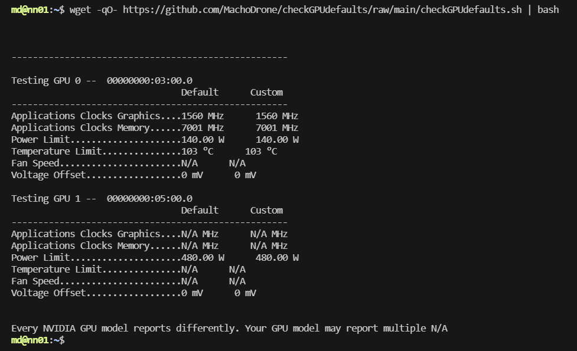

# Check the defaults or customizations of your GPU
Do you wonder if your GPU is not on Factory Defaults?
It is strongly preferred and suggested to not overclock or undervolt your GPU.
You can check the colums in this script to compare your settings.
-# Every NVIDIA GPU model reports differently. Your GPU model may report multiple N/A

```wget -qO- https://github.com/MachoDrone/checkGPUdefaults/raw/main/checkGPUdefaults.sh | bash```


